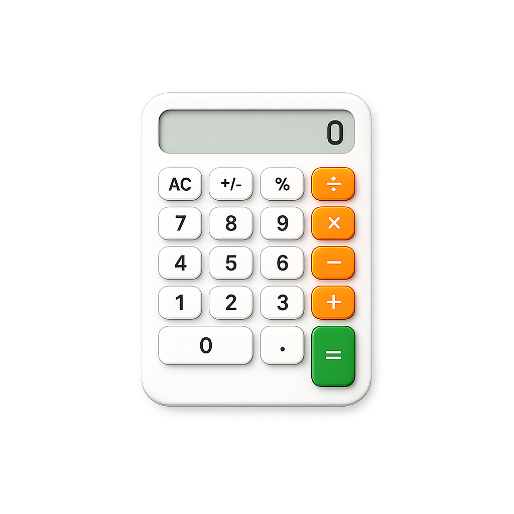

# Calculator-project_1
CH 2 계산기 과제

*****

### ✅ 계산기 성능
1. **사칙 연산**(➕,➖,✖️,➗)을 할 수 있습니다.
2. 계산된 **결과값**을 볼 수 있습니다.
3. 계산된 값 중 첫 번째 결과를 **삭제**할 수 있습니다.

### 🚨 유의 사항
1. **양의 정수**를 입력해주십시오.
    ➡️음의 정수 입력 시 재입력이 필요합니다.
2. 숫자를 **0으로 나눌 수 없습니다.**
    ➡️ 나눗셈 다음 숫자를 0으로 입력 시 재입력이 필요합니다.
